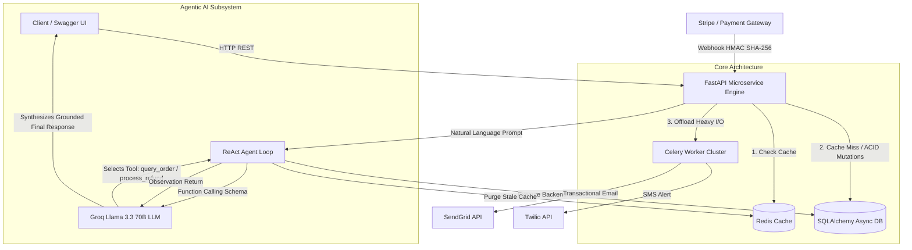

# ⚡ Enterprise Agentic AI & Billing Engine

> **A high-throughput, production-grade billing and subscription microservice built with FastAPI, Redis, SQLAlchemy Async, Celery, and an Autonomous ReAct Agentic AI powered by Groq (Llama 3.3 70B).**

[](https://fastapi.tiangolo.com)
[](https://www.python.org/)
[](https://redis.io/)
[](https://docs.celeryq.dev/)
[](https://www.sqlalchemy.org/)
[](https://groq.com/)
[](https://opensource.org/licenses/MIT)

---

## 🏛️ System Architecture



---

## 🚀 Key Enterprise Features

### 1. 🧠 Autonomous ReAct Agentic AI (`app/services/agent_service.py`)
- **Zero Hardcoded Regex / `if-else` Rules:** Uses native **LLM Function Calling** via Groq.
- **Natural Language & Multilingual:** Understands complex English, colloquial Hinglish, and refund reasons with high semantic fidelity.
- **ReAct Lifecycle (Reason ➡️ Act ➡️ Observe):**
  1. **Thought:** The model analyzes user intent and extracts parameters (`order_id`, `reason`).
  2. **Action:** Dispatches registered Python tools (`query_order_status`, `process_order_refund`).
  3. **Observation:** Receives live DB execution results and Redis purge confirmations.
  4. **Final Response:** Synthesizes an empathetic, grounded explanation for the customer.
- **Fail-Safe Fallback:** Seamless deterministic fallback if third-party AI APIs experience outages.

### 2. ⚡ Sub-2ms Redis Cache-Aside Pattern (`app/services/redis_cache.py`)
- **Cache-Aside Architecture:** Checks Redis cache first. If a cache miss occurs, falls back to the database and re-warms cache with TTL.
- **Guaranteed Consistency:** Whenever an order transitions status (via webhook or agent refund), the stale Redis key (`order:{id}`) is immediately invalidated.
- **Graceful Degradation:** Automatic socket-level timeout fallback to DB if Redis is offline.

### 3. 🛡️ Payment Webhook Security & Idempotency (`app/api/v1/orders.py`)
- **HMAC SHA-256 Verification:** Verifies payload integrity against `STRIPE_WEBHOOK_SECRET` before processing.
- **Database-Level Idempotency Table (`processed_webhooks`):** Prevents duplicate order fulfillment and double-crediting on network retries.
- **Non-Blocking Background Dispatch:** Offloads notification workers via FastAPI `BackgroundTasks`, delivering instantaneous 200 OK responses to payment providers.

### 4. 📦 Distributed Background Workers (`app/worker/tasks.py`)
- **Zero Task Loss (`task_acks_late=True`):** Celery workers acknowledge messages only after successful execution.
- **Fair Scheduling (`worker_prefetch_multiplier=1`):** Prevents single workers from hoarding tasks.
- **Exponential Backoff (`self.retry`):** Automatically handles transient network glitches when calling third-party communication APIs.

---

## 📂 Project Structure

```text
├── app/
│   ├── api/v1/
│   │   ├── orders.py          # Core REST endpoints (CRUD, Webhook, Agent)
│   │   └── router.py          # Master v1 API Router
│   ├── core/
│   │   ├── config.py          # Pydantic BaseSettings & Environment variables
│   │   └── database.py        # Async SQLAlchemy engine & session injection
│   ├── models/
│   │   └── order.py           # DB Tables: Order & ProcessedWebhook
│   ├── schemas/
│   │   └── order.py           # Pydantic V2 Request & Response schemas
│   ├── services/
│   │   ├── agent_service.py   # Groq Llama 3.3 70B ReAct Agentic Engine
│   │   └── redis_cache.py     # Redis Cache-Aside & Invalidation service
│   └── worker/
│       └── tasks.py           # Celery background tasks with retry backoff
├── main.py                    # Application entrypoint & Lifespan management
├── requirements.txt           # Production dependencies
├── .env.example               # Environment template
└── README.md                  # Project documentation
```

---

## 🛠️ Quickstart Guide

### 1. Clone & Set Up Environment

```bash
git clone https://github.com/nits-kr/Billing-Engine.git
cd Billing-Engine

# Create virtual environment
python -m venv venv
venv\Scripts\activate   # On Windows
# source venv/bin/activate  # On Linux / macOS

# Install dependencies
pip install -r requirements.txt
```

### 2. Configure Environment Variables

Copy `.env.example` to `.env` and fill in your keys:

```bash
cp .env.example .env
```

```env
GROQ_API_KEY=gsk_your_groq_api_key_here
DATABASE_URL=sqlite+aiosqlite:///./enterprise_app.db
REDIS_URL=redis://localhost:6379/0
STRIPE_WEBHOOK_SECRET=whsec_sample_secret_key_123
```

### 3. Run the Microservice

```bash
uvicorn main:app --reload
```

Server will start at: `http://127.0.0.1:8000`  
Interactive Swagger UI: **`http://127.0.0.1:8000/docs`**

---

## 🧪 Interactive API Walkthrough

| Method | Endpoint | Description |
| :--- | :--- | :--- |
| `POST` | `/api/v1/orders/` | Creates an order, writes to DB, and pre-warms Redis cache. |
| `GET` | `/api/v1/orders/{order_id}` | Fetches order via Cache-Aside (Cache Hit: ~2ms). |
| `POST` | `/api/v1/orders/webhook/payment` | Verifies HMAC, guarantees idempotency, invalidates cache. |
| `POST` | `/api/v1/orders/agent/execute` | Autonomous ReAct LLM Agent loop for status and refunds. |

### Example Agent Request:

```bash
curl -X POST "http://127.0.0.1:8000/api/v1/orders/agent/execute" \
     -H "Content-Type: application/json" \
     -d '{"prompt": "Bhai ord_fd393034 ka parcel tuta nikla, mera refund initiate kar do turant."}'
```

### Example Agent Response:

```json
{
  "thought": "LLM analyzed prompt, identified intent 'process_order_refund', and dispatched tool with params: {'order_id': 'ord_fd393034', 'reason': 'broken parcel'}.",
  "tool_called": "process_order_refund",
  "tool_result": {
    "success": true,
    "order_id": "ord_fd393034",
    "amount_cents": 4999,
    "status": "refunded",
    "reason_recorded": "broken parcel"
  },
  "final_response": "Your refund for order ord_fd393034 ($49.99) has been successfully initiated. The funds will reflect in 3-5 business days."
}
```

---

## 📄 License
This project is licensed under the MIT License - see the LICENSE file for details.
